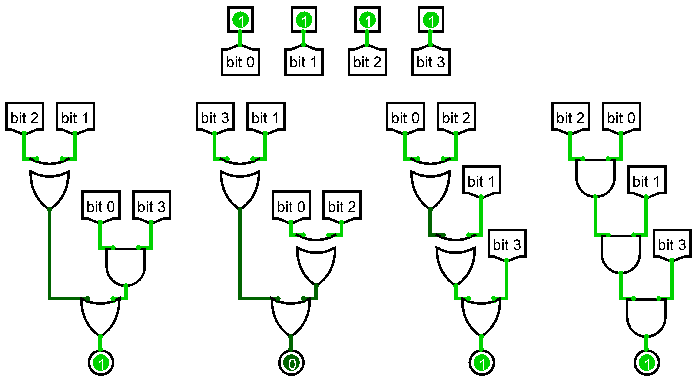

# Hardware / gates 1/3

## Challenge
One of our employees recently found some interesting documents in our archives.
These documents refer to aircraft embedded systems that have not been manufactured for a long time.
There was very little information about each component.
Even if they are not used anymore, we would like to identify the behaviours of the circuits in order to properly classify these documents.

You have to find the output of every possible input and submit it in the form
```
input1 : output1
input2 : output2
input3 : output3
input4 : output4
[...]
```

with input and output a suite of 0 and 1.

Then, computes the md5sum of this suite and enter it embraced with ECW{md5sum}.
For example, if the solution is
```
001010 : 100101
001010 : 100101
```
then the flag would be `ECW{a20e22b33336ec7bef2c33d8bba95fd6}`.

Please, check that there is no empty line at the end of your input before computing the md5sum.

NB: No need to calculate for value 0000

## Inputs
- 

## Solution
In Python, we define a function`compute()` that computes the output of the circuit from an input value. I use some helper functions to easier the bitwise operations.

```python
def compute(value):
    # Extract individual bits from input value
    b0 = (value >> 3) & 1
    b1 = (value >> 2) & 1
    b2 = (value >> 1) & 1
    b3 = (value >> 0) & 1

    # Compute the ouput
    b0_ = OR(XOR(b1, b2), AND(b0, b3))
    b1_ = OR(XOR(b1, b3), XOR(b0, b2))
    b2_ = OR(b3, XOR(b1, XOR(b0, b2)))
    b3_ = AND(b3, AND(b1, AND(b0, b2)))

    # Reassemble the output
    out = (b0_ << 3) | (b1_ << 2) | (b2_ << 1) | b3_

    # Generate expected string: <input> : <output>
    return bin(value)[2:].zfill(4) + " : " + bin(out)[2:].zfill(4) + "\n"
```

Then we simply have to loop over value from 1 to 16 (0b1111) and write the output to a file:
```python
with open("suite.txt", "w") as f:
    for val in range(1, 16):
        f.write(compute(val))
```

We get this output:
```console
$ cat suite.txt
0001 : 0110
0010 : 1110
0011 : 1110
0100 : 1110
0101 : 1010
0110 : 0100
0111 : 0110
1000 : 0110
1001 : 1110
1010 : 1000
1011 : 1110
1100 : 1100
1101 : 1110
1110 : 0110
1111 : 1011

```

There is a trailing newline at the end that we need to remove before computing the `md5sum`:
```console
$ head -c -1 suite.txt | md5sum
64887e107642b2dcdd92e7841a965d66 -

```

## Python code
Complete solution in [sol.py](sol.py)

## Flag
ECW{64887e107642b2dcdd92e7841a965d66}
